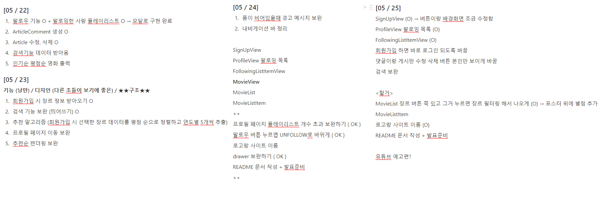

# 관통 PJT

**: Django REST API 서버 & Vue.js 를 활용한 영화 정보 기반 추천, 커뮤니티 서비스 구성**

> #### 팀원 : 정영록, 신세영

- #### 개발 과정 

  ```
  - 싸피에 출근해서 매일 할 일을 정해서 파트를 나눠 작업
  - back-end, front-end 따로 나눠 작업하지 않고 그 날 과제를 진행 후 병합
  - 퇴근 후 할 일을 간단하게 노션에 작성 후 집에가서 작업 ( 추가 작업 자율 )
  ```

- #### 개발 일지 

  ```
  아침 상의 후 노션에 할 일 작성 ( 싸피 교육 시간 중 해야할 일, 퇴근 후 해야할 일 )
  ```




- 개발 도구
  - VisualStudioCode
  - Chrome
  - Vuetify
- 개발 언어
  - Python
  - Django
  - Vue.js
  - Node.js


- #### 초기 서비스 구현 계획

```
1. accounts
    1) 회원가입 ( 영화 추천을 위한 선호 장르 선택 )
    2) 로그인, 로그아웃
    3) 프로필, 플레이리스트 ( 내 프로필에서 내가 팔로우 한 사람들을 볼 수 있고 그 사람들의 프로필에 접속		해 playlist 확인 )
    4) 커뮤니티 ( 좋아요, 리뷰, 댓글, 팔로우, 게시글 등)
    5) 게시글 작성 수에 따른 등급 부여 => 게시글 작성 시 닉네임 색 차별

2. Movie
	1) tmdb api를 이용한 영화 데이터 추출
	2) 영화 제목 검색, 평점순, 인기순, 장르별, 추천 영화
	3) 영화 디테일 : 영화 제목 / 평점 / 줄거리 / 평점 / 감독 / 배우 / 포스터 / 예고편 재생
	4) 배우, 감독 정보를 이용한 영화 추천
	5) 추천 영화 알고리즘 : 회원가입 시 선택한 장르별 / 평점순으로 1980년대 ~ 2020년대 10년 기준으로 5							개씩 영화 추천
```

- #### 초기 계획에서 구현하지 못한 서비스

```
1. 게시글 작성 수에 따른 레벨 부여
	구현 난이도는 어렵지 않지만 기본 기능 구현에 생각보다 많은 시간을 소요해 구현 실패

2. 배우, 감독 정보를 이용한 영화 추천
	이 기능도 시간부족으로 인한 구현 실패

처음 해보는 작업들이 많았고 토큰 기반 인증이라던가 원리를 모르는 요소들이 많았다. 그래서 하나하나 공부해가며 기본 기능을 구현하는데 생각보다 많은 시간을 소요했고 전체적으로 시간이 부족하여 하고싶었던 기능들을 구현하지 못했다.
```


- #### ERD ( DB 관계도 모델링 )


- #### Component 구조도


- ### 필수 기능

  - #### accounts

    - ##### 회원가입 / 로그인 

      ```
      - jwt 를 기반으로한 사용자 인증을 진행
      - 회원가입 시 영화 추천을 위한 선호 장르 선택
      ```

    

    

    

    - ##### 프로필 / 로그아웃

      ```
      - 좌측 상단 네비게이션 바를 이용해 여러가지 메뉴로 이동 가능
      - 유저 프로필 페이지에서 팔로잉 / 팔로워 / 플레이 리스트 확인
      ```

    


- #### Movie

  ```
  - tmdb api를 이용해 약 1200개의 영화 데이터 수집
  - 홈 화면에 평점순 / 인기순 / 추천순 영화 목록 표시
  - 추천 영화는 회원가입 시 선택한 장르 기준으로 80년대부터 각 연대별 평점이 높은 순으로 5개 영화 추천 	( 총 25개 )
  - 영화 장르별 조회 기능
  ```


- #### 영화 디테일

  ```
  영화 포스터 클릭 시 디테일로 이동 ( 제목 / 줄거리 / 평점 / 좋아요 / 배우 / 감독 / 리뷰 )
  ```

  

#### 

- #### 영화 검색

  ```
  모달을 이용한 영화 검색 기능 구현 ( ex ) 마      리           오  검색 시 마리오 영화 결과 출력
  ```

  


- #### Community 

  ```
  유저간 소통을 위한 자유게시판 구현 ( 게시글 생성 / 수정 / 삭제 / 좋아요 / 리뷰, 리뷰 좋아요)
  ```


-----------------------------------------------

### 느낀점

- 정영록

```
  생각했던 것 보다 기본 기능을 구현하는데 시간을 많이 뺐겼다. 토큰 기반 인증, vuetify, api를 이용해 필요한 데이터 추출 등 익숙하지 않은 작업들이라 하나하나 공부해가면서 구현하느라 오래 걸린것 같다. 
  하지만, 기본 기능을 구현하면서도 많은 것을 배웠다. 기존에 장고로만 하던 사용자 인증같은 경우 토큰을 이용해 vue와 django에서 사용자 인증을 진행했는데 토큰 정보를 로컬스토리지에 저장함으로써 유저 정보를 저장하고  작업을 수행할 때 요청으로 저장된 토큰의 정보를 보냄으로써 사용자 인증을 진행하는 것이 아주 편하다고 느껴졌다.
  이번 프로젝트를 하면서 4개월 전 api 정보를 받아오는 것도 너무 어려워하던 내가 api를 이용해 정보를 받아 내가 원하는대로 편집해서 웹페이지까지 구현한 것처럼 다음 프로젝트때는 한 번 해봤으니 더 빠르고, 더 잘 할수 있을 것 같다고 생각했다. 또한, 내가 사용할 때는 느끼지 못했던 유저 입장에서의 편의성에 대해 많은 고민을 할 수 있었다.
  첫 프로젝트이고 기간이 짧았던 만큼 구현하지 못한 기능도 있었지만 여러가지 경험을 한 것에 의의를 두고 다음 프로젝트에서는 초기 구상했던 기능들을 모두 구현할 수 있으면 좋겠다.
```

- 신세영

```
```


